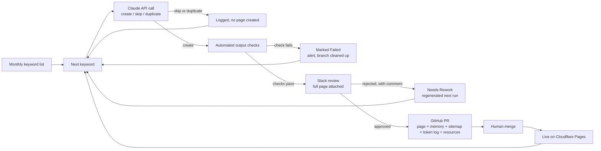
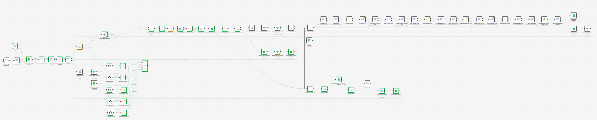

# Funnelsight


Funnelsight is a fictional growth analytics platform for marketing and revenue teams. It's built around a product-led growth motion, self-serve or hybrid with product-led sales.

It isn't a real product. It's the practical half of a certification project (RS7424, AI-driven transformation of work processes) on using AI to change how a piece of marketing work actually gets done, not just generate text faster.

**Live site:** [funnelsight.dev](https://funnelsight.dev)

## The problem

SEO content production breaks down the same way in most small marketing teams. No dedicated writer. Output split across whoever has an hour free. No shared template, no consistent quality bar.

The pages that come out aren't bad. They're inconsistent. And once tone and structure vary from page to page, nobody can explain why one underperforms, because nothing about how it was made was ever standardized.

## The solution

A single, auditable pipeline: a monthly list of keywords in, a decision and a page out for each, human review before anything ships. n8n orchestrates it. Claude decides whether a keyword earns a new page, and writes it if so. Nothing reaches GitHub without a person approving it first.

I'm a B2B growth marketer, not a software engineer. The engineering I don't have professional depth in (GitHub API calls, workflow orchestration) is where I worked with Claude as a collaborator. The process design, the editorial and brand constraints, the quality checks, and every call on what to automate versus keep manual: that part is mine.

### Architecture


See [`docs/architecture-decisions.md`](docs/architecture-decisions.md) for the reasoning behind these choices, and the trade-offs I'd reconsider if the project grew.

The actual n8n canvas, for scale:



The canvas is split into six colored zones:

| Zone | What happens there |
|---|---|
| 1 · Intake (blue) | Monthly trigger or manual run. Reads the Keywords sheet and checks required fields. |
| 2 · Loop and context (purple) | One keyword at a time. Re-reads the context files from GitHub at each iteration. |
| 3 · Generation and checks (yellow) | One Claude call per keyword, output checks, cost logging. |
| 4 · Content review (green) | Slack review of the full page. Skip and duplicate decisions are logged. |
| 5 · Publication (orange) | Five files written to a branch one after another, pull request, human merge. |
| 6 · Error path (red) | Cost logged, branch cleaned up, alert, row marked Failed, batch continues. |
## Site structure

```
/                           homepage
/trial                      trial signup page (disabled)
/resources                  guides and articles hub
/playbooks/                 use-case SEO pages
/features/                  product feature SEO pages
/glossary/                  educational / GEO SEO pages
/case-studies/              illustrative case study SEO pages
/solutions/                 audience-specific pages (hand-authored, outside the automated flow below)
/404.html                   error page
/styles.css                 single site-wide stylesheet
/fonts/                     self-hosted fonts (Inter, Space Grotesk) and their licenses
/sitemap.xml                sitemap submitted to Google Search Console
/content-memory.md          internal reference memory (see below)
/token-usage-log.md         API token consumption log, one line per published page
```

## Stack

Static site, plain HTML and CSS. No framework, no build step. Deployed on Cloudflare Pages.

JavaScript stays minimal: a submit-prevention safeguard on the (disabled) trial form, a Google Analytics 4 tag (manual `gtag.js` install, not Google Tag Manager, since a single tag doesn't need the extra layer), and a lightweight consent banner. Google's script only loads after a visitor explicitly accepts: until then, no request reaches Google. The choice is stored in `localStorage`, a "Cookie settings" link in the footer reopens the banner, and withdrawing consent clears the analytics cookies. Fonts are self-hosted for the same reason.

Both the tag and the banner live in `page-shell.html`, so every new page starts with them. Pages already published keep the version they were generated with, so any change to this block is also applied to every published page, and to the four core pages (`index.html`, `trial.html`, `resources.html`, `404.html`) that don't go through the shell.

## SEO content production

Pages under `/playbooks/`, `/features/`, `/glossary/` and `/case-studies/` go through a flow combining n8n and the Claude API. Once a month, the workflow takes the new keywords from a Google Sheet and processes them one at a time: each keyword goes all the way to publication, or to a documented decision not to publish, before the next one starts. One API call per keyword handles the publish/skip decision and the content generation. A human validates before anything publishes.

Claude writes only what needs judgment: the page, one new line for the site memory, and a resource card. The workflow builds the rest from the page's actual HTML (internal links, sitemap entry, return-link flags on the pages it links to) and inserts it into the existing files, in the same pull request. No file is ever rewritten in full.

The prompt is where I spent the most time. It sets explicit brand and editorial constraints: no invented statistics, no named competitors, no AI-sounding phrasing. It also runs a structured decision process to avoid duplicate or cannibalizing content, and a self-check step that verifies internal links and FAQ content actually match the generated page before it ships.

The duplicate-detection logic went through a real iteration. An early version compared keywords and search intent only, and let a page through that restated an existing feature under a different angle. It now also compares what the page would actually let a user do. That catches functional overlap a keyword-level check misses.

Several reliability guardrails were added after real failures, not designed in from day one:
- a response that gets cut off is never published: the keyword is flagged for manual review instead of being retried
- Claude's output is checked before review: valid filename, no existing page at that address, no leftover template placeholder, no link to a page that doesn't exist
- a failing keyword doesn't stop the batch: it's marked Failed, the cost of the call is logged, any GitHub branch already created is deleted, the maintainer gets a Slack alert, and the next keyword starts
- token consumption is logged for every API call, so cost drift is visible before it becomes a problem

## Human oversight and governance

Nothing reaches the live site without a human decision at two points.

Claude's generation call can only propose `create`, `skip` or `duplicate`. It never publishes directly. A `create` proposal goes to a Slack review before anything is written to GitHub. If it's rejected, the reviewer's notes feed automatically into the next generation pass, instead of starting over from a blank prompt.

Once approved, everything ships together in a single pull request: the new page, plus the update to the internal memory, sitemap and resource index. The automation opens the PR. A person merges it, then confirms in Slack that the page is live. If the page can't be published as is, the reviewer says why, and the keyword goes back for a new generation with that comment.


The repo's `main` branch is protected. No direct pushes are possible, a PR is required every time, and that rule can't be bypassed even by an admin token. The human review step is a structural guarantee, not a convention that could slip under deadline pressure.

A separate log records every keyword the system processes, published or not: the decision, the reasoning, and the full generated text where relevant. Over time, that log shows which kinds of keywords get skipped or flagged as duplicates, and how often a first draft needs rework, not just the pages that made it to publication.

`content-memory.md`, at the repo root, is the reference memory used to avoid duplicate content and keep internal linking consistent from page to page. The full process, the page templates, and the test and iteration log used to get there live in a separate Claude project, not in this repo.
